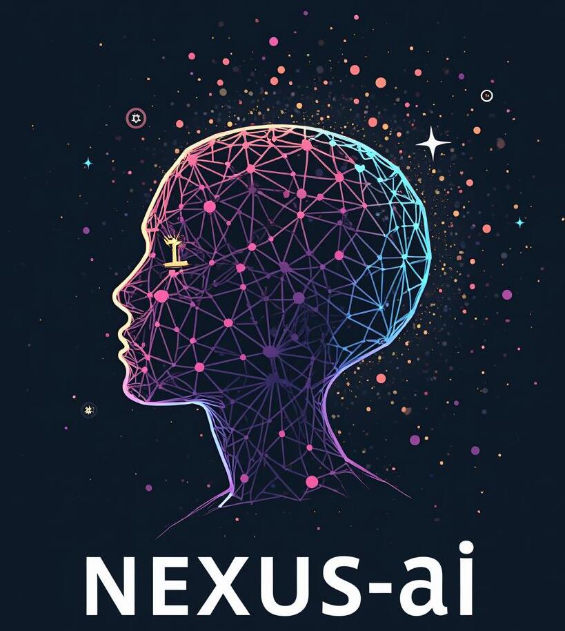

# Nexus: Igniting Collaborative Innovation 🚀

## The Convergence of Ideas, Passion, and Possibilities 🧠

Welcome to Nexus, a collaborative hub where innovative minds converge to explore the frontiers of technology and entrepreneurship. Here, we embrace the power of collective intelligence, fostering an environment where ideas thrive, passions are ignited, and groundbreaking solutions are born.

## List of top AI-tools 🤖

A curated list of Artificial Intelligence Top Tools: [AI-Tools](ai_tools.md)

## Potential Ideas

Do explore this list of potential ideas if something catches your interest: [Curated List of Projects](potential_ai_ideas.md) 

Ofcourse, we also encourage you to contribute/work on your own ideas of interest.

## Collaboration Workflow ⚙️

1. **Individual Folders**: Each collaborator will create their own folder within the repository to work on their individual ideas.

2. **Weekly Contributions**: All collaborators are required to commit at least one meaningful contribution to their folder each week, whether it's research, prototyping, or code development. 📆

3. **Monthly Sync-Up Meetings**: The team will hold virtual meetings once a month to share progress, discuss challenges, and explore potential collaborations or mergers of individual ideas. 🗓️

4. **Peer Review and Feedback**: Collaborators are encouraged to regularly review and provide constructive feedback on each other's work, fostering a collaborative and iterative development process. 👀

5. **Quarterly Hackathons** [Optional]: The team will organize quarterly hackathons to encourage rapid prototyping and experimentation with new ideas. 🔥

6. **Collaborative Repository**: The repository will feature a central wiki section where collaborators can share resources, best practices, and learnings to benefit the entire team. 📚

## Contribution Guidelines 📝

1. **Fork and Clone**: Fork the repository to your GitHub account and clone it to your local machine.

2. **Create Your Space**: Create an individual folder with your username within the  `projects` folder. This folder will serve as your dedicated workspace for the project or idea you wish to contribute.

3. **Commit and Push**: Make your changes or additions within your personal folder. Commit your work regularly with descriptive commit messages, and push your changes to your forked repository. 💻

4. **Open a Pull Request**: When you're ready to contribute your work, open a pull request from your forked repository to the main repository. In the pull request description, provide a clear summary of your changes, assign yourself to the idea or project you're working on by editing the repository's README file, and request a review. 🔃

### Sample Submissions 🔥

1. **Notebooks/Scripts/Code files**: Upload any Jupyter notebooks, scripts or code files used in your project. 💻

2. **Technical Background**: Provide a strong technical background of the problem you want to solve and the proposed solution. (docs, blogs, pdfs) 📚

3. **Demos**: Include a working link/video of the demo with the intended working of the project. 🎥

4. **Business Perspective**: Include the target audience, business plan, and other strategies to turn your project into a product/service. 📈

## Contributor Engagement and Incentives 🏆

To foster an active and engaged community, we've introduced several initiatives and incentives:

- **Idea Bounty** [Optional]: Each quarter, we'll host an "Idea Bounty" where contributors can submit their most innovative and game-changing ideas. The top-voted idea will receive recognition and potential resources to kickstart its development. 💡

- **Resources and Support**: In case of resource requirements (e.g., GPUs, API credits), contributors are encouraged to reach out to <a href="mailto:shahbhavyan12@gmail.com">shahbhavyan12@gmail.com</a>. While frugality and leveraging free resources are promoted, we aim to ensure that resource constraints do not hinder the exploration and development of promising ideas. 🆘

## Join the Movement 🌍

Are you ready to be part of something extraordinary? If you're a passionate innovator, developer, or entrepreneur eager to make a lasting impact, we invite you to join the Nexus movement. Together, we can ignite a revolution of collaborative innovation that will shape the future.

Start your journey today by exploring the existing projects or bringing in your own ideas, building on them, or reaching out to our community leaders. Let's embark on this incredible adventure and unlock the true potential of our collective genius.

Welcome to Nexus, where ideas converge, and the impossible becomes reality! ✨