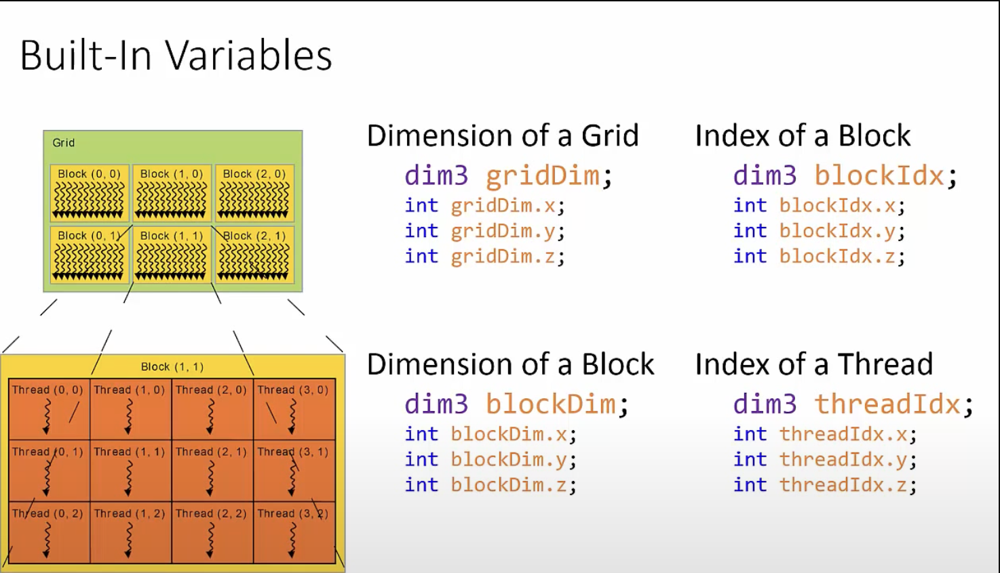

Here's the content formatted as a proper .md file:

```markdown
# CUDA Threading Model

## Basic Concepts

### Threads
- Single execution units that run kernels on the GPU
- Similar to CPU threads, but much more numerous

### Thread Blocks
- Collections of threads
- All threads within a single thread block can communicate

### Grid
- A kernel is launched as a collection of thread blocks
- This collection is called the grid

## dim3 Data Type

- 3D structure or vector type with three integers: x, y, and z
- Initialize as many of the three coordinates as needed

Examples:
```cuda
dim3 threads(256);        // x -> 256, y -> 1, z -> 1
dim3 blocks(100, 100);
dim3 anotherOne(10, 54, 32);
```

## Kernel Invocation

- Host calls the kernel using triple chevrons `<<<>>>`
- Inside the chevrons, specify the total number of blocks and threads per block

Example:
```cuda
custom_kernel<<<100, 256>>>
```

## Limitations

- Maximum 1024 threads per block
- Maximum 2^32 - 1 blocks in a single launch

## Block Abstraction

Higher performance GPUs can run more blocks concurrently, improving workload processing without code changes.

## Thread Variables

Each thread has access to:

1. `threadIdx`: Thread index within the block
2. `blockIdx`: Block index within the grid
3. `blockDim`: Block dimension in threads
4. `gridDim`: Grid dimensions in blocks

All are `dim3` structures and can be read in the kernel to assign workloads to threads.



## A100 Tensor Core GPU Specifications

- 7 GPCs (Graphics Processing Clusters)
- 7 or 8 TPCs (Texture Processing Clusters) per GPC
- 2 SMs (Streaming Multiprocessors) per TPC
- Up to 16 SMs per GPC
- 108 SMs total

### Per SM:
- 64 FP32 CUDA Cores
- 4 third-generation Tensor Cores

### Total:
- 6912 FP32 CUDA Cores per GPU
- 432 third-generation Tensor Cores per GPU

### Memory:
- 5 HBM2 stacks
- 10 512-bit memory controllers
```


Here's the content formatted as a proper .md file:

```markdown
# CUDA Matrix Transpose

## Code Overview

This CUDA program demonstrates two methods of matrix transposition:

1. Standard in-place transpose
2. Optimized upper triangular transpose

The code includes:

- Kernel functions for both transpose methods
- Host code for memory allocation, data transfer, and kernel invocation
- A utility function to print matrices

## Key Components

### Kernel Functions

1. `matrixTranspose`: Standard in-place transpose
2. `matrixOptimizedTranspose`: Optimized upper triangular transpose

### Main Function

- Initializes a 128x128 matrix
- Allocates memory on host and device
- Copies data to device
- Launches kernels
- Copies results back to host
- Prints results

## Performance Profile


```bash

==17204== Profiling result:
            Type  Time(%)      Time     Calls       Avg       Min       Max  Name
 GPU activities:   44.80%  21.504us         2  10.752us  10.432us  11.072us  [CUDA memcpy HtoD]
                   28.87%  13.856us         2  6.9280us  6.9120us  6.9440us  [CUDA memcpy DtoH]
                   13.93%  6.6880us         1  6.6880us  6.6880us  6.6880us  matrixTranspose(float*, int, int)
                   12.40%  5.9510us         1  5.9510us  5.9510us  5.9510us  matrixOptimizedTranspose(float*, int, int)
      API calls:   99.64%  192.80ms         2  96.399ms  3.9830us  192.79ms  cudaMalloc
                    0.11%  221.99us         2  110.99us  44.611us  177.38us  cudaFree
                    0.08%  163.71us         4  40.926us  35.918us  48.681us  cudaMemcpy
                    0.08%  150.38us       114  1.3190us     146ns  64.351us  cuDeviceGetAttribute
                    0.06%  113.83us         2  56.914us  7.9290us  105.90us  cudaLaunchKernel
                    0.01%  18.819us         2  9.4090us  9.2040us  9.6150us  cudaDeviceSynchronize

```

## Notes on Profile

1. Memory operations (HtoD and DtoH) consume the most GPU time (73.67%).
2. The optimized kernel (`matrixOptimizedTranspose`) is slightly faster than the standard kernel.
3. `cudaMalloc` dominates API call time, which is typical for small kernels.
4. Actual kernel execution time is relatively small compared to memory operations.

## Optimization Opportunities

1. Use shared memory to reduce global memory accesses.
2. Implement coalesced memory access patterns.
3. Consider using larger matrices to amortize memory transfer costs.
4. Explore asynchronous memory transfers and kernel launches.

```